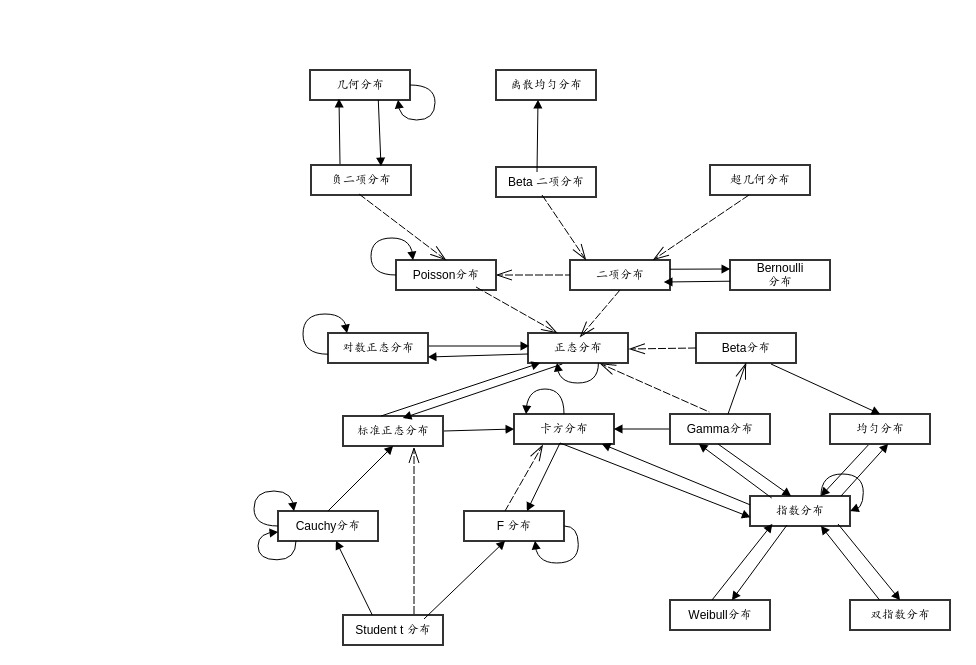
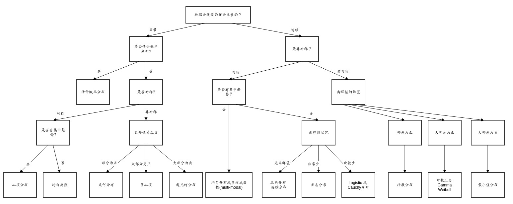

```{r include=FALSE}
library(fitdistrplus)
library(CircStats)
library(ggplot2)
```

如果给定一种概率分布，通常会有四类计算问题：计算其概率密度density(d);计算其概率分布probability(p);计算其百分位数quantile(q);随机数模拟random(r),R中常见的函数、分布和参数如下

R funciton    Distribution	       Parameters
----          ----                 ----
beta	        beta	               shape1,shape2
binom	        binomial	           sample,size,probability
cauchy	      Cauchy	             location,scale
exp	          exponential	         rate(optional)
chisq	        Chi-squared	         degrees of freedom
f	            Fisher's F	         df1,df2
gamma	        gamma	               shape
geom	        geometric	           probability
hyper	        hypergeometric	     m,n,k
lnorm	        lognormal	           mean,standard deviation
logis	        logistic	           location,scale
nbinom	      negative binomial    size,probability
norm	        normal	             mean,standard deviation
pois	        Poisson	             mean
signrank    	Wilcoxon signed rank sample size n
t	            Student's t	         degree of freedom
unif	        uniform	             minimum,maximum(opt.)
weibull	      Weibull	             shape
wilcox	      Wilcoxon rank sum    m,n

##正态分布(Normal distribution)
又名高斯分布(Gaussian distribution)，是一个在数学、物理及工程等领域都非常重要的概率分布，在统计学的许多方面有着重大的影响力。若随机变量X服从一个数学期望为$μ$、方差为$\sigma^2$的正态分布，记为$N(u，\sigma^2)$。其概率密度函数为正态分布的期望值$u$决定了其位置，其标准差$\sigma^2$决定了分布的幅度。因其曲线呈钟形，因此人们又经常称之为钟形曲线。我们通常所说的标准正态分布是$u$ = 0,$\sigma$ = 1的正态分布。
概率密度函数
$$f(x)=\frac{1}{\sqrt{2\pi}\sigma}e^{-\frac{(x-\mu)^2}{2\sigma ^2}}$$
```{r}
fun1 <- function(x){
  y <- dnorm(x,mean = 0,sd = 1)
  return(y)
}
  
fun2 <- function(x){
  y <- dnorm(x,mean = 0,sd = 0.5)
  return(y)
} 

fun3 <- function(x){
  y <- dnorm(x,mean = 0,sd = 2)
  return(y)
} 

ggplot(NULL, aes(x=x, colour = g)) +
  stat_function(data = data.frame(x = -5:5, g = factor(1)), fun = fun1) +
  stat_function(data = data.frame(x = -5:5, g = factor(2)), fun = fun2) +
  stat_function(data = data.frame(x = -5:5, g = factor(3)), fun = fun3) +
  scale_colour_manual(values = c("red", "green","blue"), labels = c("red", "green","blue"))+
  ylab(label = "density")+
  labs(title="The Normal Density Distribution")
```

累积分布函数
$$F(x;u,\sigma )=\frac{1}{\sqrt{2\pi}\sigma} \int_{-\infty }^{x}exp(-\frac{(t-u)^2}{2\sigma ^2})dt$$
```{r}
fun1 <- function(x){
  y <- pnorm(x,mean = 0,sd = 1)
  return(y)
}
  
fun2 <- function(x){
  y <- pnorm(x,mean = 0,sd = 0.5)
  return(y)
} 

fun3 <- function(x){
  y <- pnorm(x,mean = 0,sd = 2)
  return(y)
} 

ggplot(NULL, aes(x=x, colour = g)) +
  stat_function(data = data.frame(x = -5:5, g = factor(1)), fun = fun1) +
  stat_function(data = data.frame(x = -5:5, g = factor(2)), fun = fun2) +
  stat_function(data = data.frame(x = -5:5, g = factor(3)), fun = fun3) +
  scale_colour_manual(values = c("red", "green","blue"), labels = c("red", "green","blue"))+
  ylab(label = "density")+
  labs(title="The Normal Cumulative Distribution")
```
分布检验
Shapiro-Wilk正态分布检验: 用来检验是否数据符合正态分布，类似于线性回归的方法一样，是检验其于回归曲线的残差。该方法推荐在样本量很小的时候使用，样本在3到5000之间。该检验原假设为$H_{0}$:数据集符合正态分布，统计量W为：
$$W=\frac{(\sum_{i=1}^{n}a_{i}x_{(i)})^2}{\sum_{i=1}^{n}(x_{i}-\bar{x})^2}$$
统计量W 最大值是1，越接近1，表示样本与正态分布匹配,p值，如果p-value小于显著性水平$\alpha$(0.05)，则拒绝$H_{0}$
```{r}
set.seed(1)
S<-rnorm(1000)
shapiro.test(S)
```
结论: W接近1，p-value>0.05，不能拒绝原假设，所以数据集S符合正态分布！

Kolmogorov-Smirnov连续分布检验:检验单一样本是不是服从某一预先假设的特定分布的方法。以样本数据的累计频数分布与特定理论分布比较，若两者间的差距很小，则推论该样本取自某特定分布族。该检验原假设为$H_{0}$:数据集符合正态分布，$H_{1}$:样本所来自的总体分布不符合正态分布。令$F0(x)$表示预先假设的理论分布，$Fn(x)$表示随机样本的累计概率(频率)函数.
统计量D为: $D=max|F0(x) - Fn(x)|$
D值越小，越接近0，表示样本数据越接近正态分布,p值，如果p-value小于显著性水平$\alpha$(0.05)，则拒绝H_{0}
```{r}
set.seed(1)
S<-rnorm(1000)
ks.test(S, "pnorm")
```
结论: D值很小, p-value>0.05，不能拒绝原假设，所以数据集S符合正态分布！

## 指数分布
指数分布(Exponential distribution)用来表示独立随机事件发生的时间间隔，比如旅客进机场的时间间隔、中文维基百科新条目出现的时间间隔等等。许多电子产品的寿命分布一般服从指数分布。有的系统的寿命分布也可用指数分布来近似。它在可靠性研究中是最常用的一种分布形式。指数分布是伽玛分布和weibull分布的特殊情况，产品的失效是偶然失效时，其寿命服从指数分布。指数分布可以看作当weibull分布中的形状系数等于1的特殊分布，指数分布的失效率是与时间t无关的常数，所以分布函数简单。
概率密度函数
$$f(x;\lambda)=\left\{\begin{matrix} \lambda e^{-\lambda x},x>=0
 &  & \\ 0,x<0
\end{matrix}\right.$$
其中$\lambda$> 0是分布的一个参数，常被称为率参数（rate parameter）。即每单位时间发生该事件的次数。指数分布的区间是$[0,\infty)$。 如果一个随机变量X 呈指数分布，则可以写作：$X$ ~ Exponential（$\lambda$）。
```{r}
fun1 <- function(x){
  y <- dexp(x,0.5)
  return(y)
}
  
fun2 <- function(x){
  y <- dexp(x,1)
  return(y)
} 

fun3 <- function(x){
  y <- dexp(x,2)
  return(y)
} 

ggplot(NULL, aes(x=x, colour = g)) +
  stat_function(data = data.frame(x=seq(0,3,length.out=100), g = factor(1)), fun = fun1) +
  stat_function(data = data.frame(x=seq(0,3,length.out=100), g = factor(2)), fun = fun2) +
  stat_function(data = data.frame(x=seq(0,3,length.out=100), g = factor(3)), fun = fun3) +
  scale_colour_manual(values = c("red", "green","blue"), labels = c("red", "green","blue"))+
  ylab(label = "density")+
  labs(title="The Exponential Density Distribution")
```
累积分布函数
$$F(x;\lambda)=\left\{\begin{matrix} 1-e^{\lambda x},x>=0
 &  & \\ 0,x<0
\end{matrix}\right.$$
```{r}
fun1 <- function(x){
  y <- pexp(x,0.5)
  return(y)
}
  
fun2 <- function(x){
  y <- pexp(x,1)
  return(y)
} 

fun3 <- function(x){
  y <- pexp(x,2)
  return(y)
} 

ggplot(NULL, aes(x=x, colour = g)) +
  stat_function(data = data.frame(x=seq(0,3,length.out=100), g = factor(1)), fun = fun1) +
  stat_function(data = data.frame(x=seq(0,3,length.out=100), g = factor(2)), fun = fun2) +
  stat_function(data = data.frame(x=seq(0,3,length.out=100), g = factor(3)), fun = fun3) +
  scale_colour_manual(values = c("red", "green","blue"), labels = c("red", "green","blue"))+
  ylab(label = "density")+
  labs(title="The Exponential Cumulative Distribution Function")
```
分布检验
Kolmogorov-Smirnov连续分布检验:检验单一样本是不是服从某一预先假设的特定分布的方法。以样本数据的累计频数分布与特定理论分布比较，若两者间的差距很小，则推论该样本取自某特定分布族。该检验原假设为$H_{0}$:数据集符合指数分布，$H_{1}$:样本所来自的总体分布不符合指数分布。令$F0(x)$表示预先假设的理论分布，$Fn(x)$表示随机样本的累计概率(频率)函数.
统计量D为: $D=max|F0(x) - Fn(x)|$
D值越小，越接近0，表示样本数据越接近指数分布,p值，如果p-value小于显著性水平$\alpha$(0.05)，则拒绝$H_{0}$
```{r}
set.seed(1)
S<-rexp(1000)
ks.test(S, "pexp")
```
结论: D值很小, p-value>0.05，不能拒绝原假设，所以数据集S符合指数分布！

##γ(伽玛)分布
伽玛分布(Gamma)是著名的皮尔逊概率分布函数簇中的重要一员，称为皮尔逊Ⅲ型分布。它的曲线有一个峰，但左右不对称。伽玛分布中的参数α，称为形状参数，β称为尺度参数。
$$Ga(x)=\frac{1}{\beta^{\alpha}\Gamma(\alpha)}x^{\alpha-1}e^{-\frac{x}{\beta}},x>0$$
伽玛函数为：
$$\Gamma(x)=\int_{0}^{\infty }t^{x-1}e^{-t}dt$$
伽玛函数是阶乘在实数上的泛化。
概率密度函数
$$f(x)=x^{k-1}\frac{exp(-x/\theta )}{\Gamma (k)\theta^{k}}$$
```{r}
fun1 <- function(x){
  y <- dgamma(x,1,2)
  return(y)
}
  
fun2 <- function(x){
  y <- dgamma(x,2,2)
  return(y)
} 

fun3 <- function(x){
  y <- dgamma(x,5,1)
  return(y)
} 

ggplot(NULL, aes(x=x, colour = g)) +
  stat_function(data = data.frame(x=seq(0,10,length.out=100), g = factor(1)), fun = fun1) +
  stat_function(data = data.frame(x=seq(0,10,length.out=100), g = factor(2)), fun = fun2) +
  stat_function(data = data.frame(x=seq(0,10,length.out=100), g = factor(3)), fun = fun3) +
  scale_colour_manual(values = c("red", "green","blue"), labels = c("red", "green","blue"))+
  ylab(label = "density")+
  labs(title="The Gamma Density Distribution")
```
累积分布函数
$$f(x)=\frac{\gamma (k,x/\theta )}{\Gamma (k)}$$
```{r}
fun1 <- function(x){
  y <- pgamma(x,1,2)
  return(y)
}
  
fun2 <- function(x){
  y <- pgamma(x,2,2)
  return(y)
} 

fun3 <- function(x){
  y <- pgamma(x,5,1)
  return(y)
} 

ggplot(NULL, aes(x=x, colour = g)) +
  stat_function(data = data.frame(x=seq(0,10,length.out=100), g = factor(1)), fun = fun1) +
  stat_function(data = data.frame(x=seq(0,10,length.out=100), g = factor(2)), fun = fun2) +
  stat_function(data = data.frame(x=seq(0,10,length.out=100), g = factor(3)), fun = fun3) +
  scale_colour_manual(values = c("red", "green","blue"), labels = c("red", "green","blue"))+
  ylab(label = "density")+
  labs(title="The Gamma Cumulative Distribution Function")
```
分布检验
Kolmogorov-Smirnov连续分布检验:检验单一样本是不是服从某一预先假设的特定分布的方法。以样本数据的累计频数分布与特定理论分布比较，若两者间的差距很小，则推论该样本取自某特定分布族。该检验原假设为$H_{0}$:数据集符合指数分布，$H_{1}$:样本所来自的总体分布不符合指数分布。令$F0(x)$表示预先假设的理论分布，$Fn(x)$表示随机样本的累计概率(频率)函数.
统计量D为: $D=max|F0(x) - Fn(x)|$
D值越小，越接近0，表示样本数据越接近γ(伽玛)分布,p值，如果p-value小于显著性水平$\alpha$(0.05)，则拒绝$H_{0}$
```{r}
set.seed(1)
S<-rgamma(1000,1)
ks.test(S, "pgamma", 1)
```
结论: D值很小, p-value>0.05，不能拒绝原假设，所以数据集S符合shape=1伽玛分布！
```{r}
ks.test(S, "pgamma", 2)
```
结论:D值不够小, p-value<0.05，拒绝原假设，所以数据集S符合shape=2伽玛分布！

##weibull分布
weibull(韦伯)分布，又称韦氏分布或威布尔分布，是可靠性分析和寿命检验的理论基础。Weibull分布能被应用于很多形式，分布由形状、尺度（范围）和位置三个参数决定。其中形状参数是最重要的参数，决定分布密度曲线的基本形状，尺度参数起放大或缩小曲线的作用，但不影响分布的形状。Weibull分布通常用在故障分析领域( field of failure analysis)中；尤其是它可以模拟(mimic) 故障率(failture rate)持续( over time)变化的分布。故障率为：
一直为常量(constant over time)， 那么 $\alpha$ = 1， 暗示在随机事件中发生
一直减少(decreases over time)，那么$\alpha$ < 1， 暗示"早期失效(infant mortality)"
一直增加(increases over time)，那么$\alpha$ > 1， 暗示"耗尽(wear out)" 随着时间的推进，失败的可能性变大
概率密度函数
$$f(x;\lambda,k)=\left\{\begin{matrix}
{k/\lambda (x/\lambda)^{k-1}e^{-(x/\lambda)^{k}}}, \quad x\geq 0
 & \\ 0,\quad x<0
 & 
\end{matrix}\right.$$
```{r}
fun1 <- function(x){
  y <- dweibull(x,0.5)
  return(y)
}
  
fun2 <- function(x){
  y <- dweibull(x,1)
  return(y)
} 

fun3 <- function(x){
  y <- dweibull(x,5)
  return(y)
} 

ggplot(NULL, aes(x=x, colour = g)) +
  stat_function(data = data.frame(x=seq(0,2.5,length.out=100), g = factor(1)), fun = fun1) +
  stat_function(data = data.frame(x=seq(0,2.5,length.out=100), g = factor(2)), fun = fun2) +
  stat_function(data = data.frame(x=seq(0,2.5,length.out=100), g = factor(3)), fun = fun3) +
  scale_colour_manual(values = c("red", "green","blue"), labels = c("red", "green","blue"))+
  ylab(label = "density")+
  labs(title="The Weibull Density Distribution")
```
累积分布函数
$$ F(x)=1-e^{-(x/\lambda)^{k}}$$
```{r}
fun1 <- function(x){
  y <- pweibull(x,0.5)
  return(y)
}
  
fun2 <- function(x){
  y <- pweibull(x,1)
  return(y)
} 

fun3 <- function(x){
  y <- pweibull(x,5)
  return(y)
} 

ggplot(NULL, aes(x=x, colour = g)) +
  stat_function(data = data.frame(x=seq(0,2.5,length.out=100), g = factor(1)), fun = fun1) +
  stat_function(data = data.frame(x=seq(0,2.5,length.out=100), g = factor(2)), fun = fun2) +
  stat_function(data = data.frame(x=seq(0,2.5,length.out=100), g = factor(3)), fun = fun3) +
  scale_colour_manual(values = c("red", "green","blue"), labels = c("red", "green","blue"))+
  ylab(label = "density")+
  labs(title="The Weibull Cumulative Distribution Function")
```
分布检验
Kolmogorov-Smirnov连续分布检验:检验单一样本是不是服从某一预先假设的特定分布的方法。以样本数据的累计频数分布与特定理论分布比较，若两者间的差距很小，则推论该样本取自某特定分布族。该检验原假设为$H_{0}$:数据集符合指数分布，$H_{1}$:样本所来自的总体分布不符合指数分布。令$F0(x)$表示预先假设的理论分布，$Fn(x)$表示随机样本的累计概率(频率)函数.
统计量D为: $D=max|F0(x) - Fn(x)|$
D值越小，越接近0，表示样本数据越接近weibull分布,p值，如果p-value小于显著性水平$\alpha$(0.05)，则拒绝$H_{0}$
```{r}
set.seed(1)
S<-rweibull(1000,1)
ks.test(S, "pweibull",1)
```
结论: D值很小, p-value>0.05，不能拒绝原假设，所以数据集S符合shape=1的weibull分布！

## F分布
F-分布（F-distribution）是一种连续概率分布，被广泛应用于似然比率检验，特别是ANOVA中。F分布定义为：设X、Y为两个独立的随机变量，X服从自由度为k1的卡方分布，Y服从自由度为k2的卡方分布，这2 个独立的卡方分布被各自的自由度除以后的比率这一统计量的分布。即： 上式F服从第一自由度为k1，第二自由度为k2的F分布。
F分布是一种非对称分布它有两个自由度，即n1 -1和n2-1，相应的分布记为F（ n1 –1， n2-1）， n1 –1通常称为分子自由度， n2-1通常称为分母自由度
F分布是一个以自由度n1 –1和n2-1为参数的分布族，不同的自由度决定了F 分布的形状
F分布的倒数性质：$F\alpha,df1,df2=1/F1-\alpha,df1,df2[1]$
概率密度函数
$$f(x)=\frac{\sqrt{\frac{d1x^{d1}d2^{d2}}{(d1x+d2)^{d1+d2}}}}{xB(\frac{d1}{2},\frac{d2}{2})}$$
B是Beta函数(beta function)
```{r}
fun1 <- function(x){
  y <- -df(x,1,1,0)
  return(y)
}
  
fun2 <- function(x){
  y <- -df(x,1,1,2)
  return(y)
} 

fun3 <- function(x){
  y <- -df(x,2,2,2)
  return(y)
} 

ggplot(NULL, aes(x=x, colour = g)) +
  stat_function(data = data.frame(x=seq(0,5,length.out=100), g = factor(1)), fun = fun1) +
  stat_function(data = data.frame(x=seq(0,5,length.out=100), g = factor(2)), fun = fun2) +
  stat_function(data = data.frame(x=seq(0,5,length.out=100), g = factor(3)), fun = fun3) +
  scale_colour_manual(values = c("red", "green","blue"), labels = c("red", "green","blue"))+
  ylab(label = "density")+
  labs(title="The F Density Distribution")
```
累积分布函数
$$F(x)=I\frac{d1x}{d1x+d2}(d1/2,d2/2)$$
I是不完全Beta函数
```{r}
fun1 <- function(x){
  y <- -pf(x,1,1,0)
  return(y)
}
  
fun2 <- function(x){
  y <- -pf(x,1,1,2)
  return(y)
} 

fun3 <- function(x){
  y <- -pf(x,2,2,2)
  return(y)
} 

ggplot(NULL, aes(x=x, colour = g)) +
  stat_function(data = data.frame(x=seq(0,5,length.out=100), g = factor(1)), fun = fun1) +
  stat_function(data = data.frame(x=seq(0,5,length.out=100), g = factor(2)), fun = fun2) +
  stat_function(data = data.frame(x=seq(0,5,length.out=100), g = factor(3)), fun = fun3) +
  scale_colour_manual(values = c("red", "green","blue"), labels = c("red", "green","blue"))+
  ylab(label = "density")+
  labs(title="The F Cumulative Distribution Function")
```
分布检验
Kolmogorov-Smirnov连续分布检验:检验单一样本是不是服从某一预先假设的特定分布的方法。以样本数据的累计频数分布与特定理论分布比较，若两者间的差距很小，则推论该样本取自某特定分布族。该检验原假设为$H_{0}$:数据集符合指数分布，$H_{1}$:样本所来自的总体分布不符合指数分布。令$F0(x)$表示预先假设的理论分布，$Fn(x)$表示随机样本的累计概率(频率)函数.
统计量D为: $D=max|F0(x) - Fn(x)|$
D值越小，越接近0，表示样本数据越接近F分布,p值，如果p-value小于显著性水平$\alpha$(0.05)，则拒绝$H_{0}$
```{r}
set.seed(1)
S<-rf(1000,1,1,2)
ks.test(S, "pf", 1,1,2)
```

## T分布
学生t-分布（Student's t-distribution），可简称为t分布。应用在估计呈正态分布的总体的平均数。它是对两个样本均值差异进行显著性测试的学生t检定的基础。学生t检定改进了Z检定（Z-test），因为Z检定以总体标准差已知为前提。虽然在样本数量大（超过30个）时，可以应用Z检定来求得近似值，但Z检定用在小样本会产生很大的误差，因此必须改用学生t检定以求准确。在总体标准差未知的情况下，不论样本数量大或小皆可应用学生t检定。在待比较的数据有三组以上时，因为误差无法压低，此时可以用变异数分析（ANOVA）代替学生t检定。
概率密度函数
$$f(x)=\frac{\Gamma ((\nu+1)/2)}{\sqrt{\nu \pi }\Gamma (\nu/2)(1+x^{2}/\nu)^{(v1+1)/2}}$$
$v$ 等于n − 1。 T的分布称为t-分布。参数$\nu$ 一般被称为自由度。
$\gamma$是伽玛函数。
```{r}
fun1 <- function(x){
  y <-dt(x,1,0)
  return(y)
}
  
fun2 <- function(x){
  y <-dt(x,5,0)
  return(y)
} 

fun3 <- function(x){
  y <-dt(x,5,2)
  return(y)
} 

ggplot(NULL, aes(x=x, colour = g)) +
  stat_function(data = data.frame(x=seq(-5,5,length.out=100), g = factor(1)), fun = fun1) +
  stat_function(data = data.frame(x=seq(-5,5,length.out=100), g = factor(2)), fun = fun2) +
  stat_function(data = data.frame(x=seq(-5,5,length.out=100), g = factor(3)), fun = fun3) +
  scale_colour_manual(values = c("red", "green","blue"), labels = c("red", "green","blue"))+
  ylab(label = "density")+
  labs(title="The T Density Distribution")
```
累积分布函数
$$f(x)=\frac{1}{2}+\frac{x\Gamma((\nu+1)/2)_{2}F_{1}(\frac{1}{2},(\nu+1)/2;\frac{3}{2};-\frac{x^{2}}{v})}{\sqrt{\nu \pi }\Gamma (\nu/2)}$$
$\nu$等于n − 1。 T的分布称为t-分布。参数$\nu$一般被称为自由度。
$\gamma$是伽玛函数。
```{r}
fun1 <- function(x){
  y <-pt(x,1,0)
  return(y)
}
  
fun2 <- function(x){
  y <-pt(x,5,0)
  return(y)
} 

fun3 <- function(x){
  y <-pt(x,5,2)
  return(y)
} 

ggplot(NULL, aes(x=x, colour = g)) +
  stat_function(data = data.frame(x=seq(-5,5,length.out=100), g = factor(1)), fun = fun1) +
  stat_function(data = data.frame(x=seq(-5,5,length.out=100), g = factor(2)), fun = fun2) +
  stat_function(data = data.frame(x=seq(-5,5,length.out=100), g = factor(3)), fun = fun3) +
  scale_colour_manual(values = c("red", "green","blue"), labels = c("red", "green","blue"))+
  ylab(label = "density")+
  labs(title="The T Cumulative Distribution Function")
```
分布检验
Kolmogorov-Smirnov连续分布检验:检验单一样本是不是服从某一预先假设的特定分布的方法。以样本数据的累计频数分布与特定理论分布比较，若两者间的差距很小，则推论该样本取自某特定分布族。该检验原假设为$H_{0}$:数据集符合指数分布，$H_{1}$:样本所来自的总体分布不符合指数分布。令$F0(x)$表示预先假设的理论分布，$Fn(x)$表示随机样本的累计概率(频率)函数.
统计量D为: $D=max|F0(x) - Fn(x)|$
D值越小，越接近0，表示样本数据越接近T分布,p值，如果p-value小于显著性水平$\alpha$(0.05)，则拒绝$H_{0}$
```{r}
set.seed(1)
S<-rt(1000, 1,2)
ks.test(S, "pt", 1, 2)
```
结论: D值很小, p-value>0.05，不能拒绝原假设，所以数据集S符合df1=1, ncp=2的T分布！

##β(贝塔Beta)分布
贝塔分布(Beta Distribution)是指一组定义在(0,1)区间的连续概率分布，Beta分布有α和β两个参数$\alpha$,$\beta$>0，其中$\alpha$为成功次数加1，$\beta$为失败次数加1。Beta分布的一个重要应该是作为伯努利分布和二项式分布的共轭先验分布出现，在机器学习和数理统计学中有重要应用。贝塔分布中的参数可以理解为伪计数，伯努利分布的似然函数可以表示为，表示一次事件发生的概率，它为贝塔有相同的形式，因此可以用贝塔分布作为其先验分布。
概率密度函数
$$f(x)=\frac{1}{B(\alpha,\beta )}(x^{\alpha-1})(1-x)^{\beta-1}$$
随机变量X服从参数为$\alpha,\beta$，服从Beta分布
$\gamma$是伽玛函数
```{r}
fun1 <- function(x){
  y <-dbeta(x,0.5,0.5)
  return(y)
}
  
fun2 <- function(x){
  y <-dbeta(x,5,1)
  return(y)
} 

fun3 <- function(x){
  y <-dbeta(x,1,3)
  return(y)
} 

ggplot(NULL, aes(x=x, colour = g)) +
  stat_function(data = data.frame(x=seq(0,1,length.out=100), g = factor(1)), fun = fun1) +
  stat_function(data = data.frame(x=seq(0,1,length.out=100), g = factor(2)), fun = fun2) +
  stat_function(data = data.frame(x=seq(0,1,length.out=100), g = factor(3)), fun = fun3) +
  scale_colour_manual(values = c("red", "green","blue"), labels = c("red", "green","blue"))+
  ylab(label = "density")+
  labs(title="The Beta Density Distribution")
```
累积分布函数
$$F(x;\alpha,\beta )=\frac{B_{x}(\alpha,\beta)}{B(\alpha,\beta)}=I_{x}(\alpha,\beta)$$
I是正则不完全Beta函数
```{r}
fun1 <- function(x){
  y <-pbeta(x,0.5,0.5)
  return(y)
}
  
fun2 <- function(x){
  y <-pbeta(x,5,1)
  return(y)
} 

fun3 <- function(x){
  y <-pbeta(x,1,3)
  return(y)
} 

ggplot(NULL, aes(x=x, colour = g)) +
  stat_function(data = data.frame(x=seq(0,1,length.out=100), g = factor(1)), fun = fun1) +
  stat_function(data = data.frame(x=seq(0,1,length.out=100), g = factor(2)), fun = fun2) +
  stat_function(data = data.frame(x=seq(0,1,length.out=100), g = factor(3)), fun = fun3) +
  scale_colour_manual(values = c("red", "green","blue"), labels = c("red", "green","blue"))+
  ylab(label = "density")+
  labs(title="The Beta Cumulative Distribution Function")
```
分布检验
Kolmogorov-Smirnov连续分布检验:检验单一样本是不是服从某一预先假设的特定分布的方法。以样本数据的累计频数分布与特定理论分布比较，若两者间的差距很小，则推论该样本取自某特定分布族。该检验原假设为$H_{0}$:数据集符合指数分布，$H_{1}$:样本所来自的总体分布不符合指数分布。令$F0(x)$表示预先假设的理论分布，$Fn(x)$表示随机样本的累计概率(频率)函数.
统计量D为: $D=max|F0(x) - Fn(x)|$
D值越小，越接近0，表示样本数据越接近β(贝塔Beta)分布,p值，如果p-value小于显著性水平$\alpha$(0.05)，则拒绝$H_{0}$
```{r}
set.seed(1)
S<-rbeta(1000,1,2)
ks.test(S, "pbeta",1,2)
```
结论: D值很小, p-value>0.05，不能拒绝原假设，所以数据集S符合shape1=1, shape2=2的Beta分布！

## $\chi^2$(卡方)分布
总体$X\sim N(\mu,\sigma^{2})$,则样本的统计量$\frac{1}{\sigma ^{2}}\sum_{i=1}^{n}(X_{i}-\mu)$,服从自由度为n的$\chi^2$分布。样本统计量$\frac{1}{\sigma ^{2}}\sum_{i=1}^{n}(X_{i}-\bar{X})$,服从自由度为n-1的$\chi^2$分布。
若n个相互独立的随机变量$\varepsilon _{1},\varepsilon _{2},...,\varepsilon _{n}$ ，均服从标准正态分布（也称独立同分布于标准正态分布），则这n个服从标准正态分布的随机变量的平方和构成一新的随机变量，其分布规律称为$\chi^2$分布（chi-square distribution）。其中参数n称为自由度，自由度不同就是另一个$\chi^2$分布，正如正态分布中均值或方差不同就是另一个正态分布一样。
概率密度函数
$$f_{k}(x)=\frac{(1/2)^{k/2}}{\Gamma (k/2)}x^{k/2-1}e^{-x/2}$$
$\gamma$是伽玛函数
```{r}
fun1 <- function(x){
  y <-dchisq(x,1)
  return(y)
}
  
fun2 <- function(x){
  y <-dchisq(x,2)
  return(y)
} 

fun3 <- function(x){
  y <-dchisq(x,3)
  return(y)
} 

ggplot(NULL, aes(x=x, colour = g)) +
  stat_function(data = data.frame(x=seq(0,10,length.out=100), g = factor(1)), fun = fun1) +
  stat_function(data = data.frame(x=seq(0,10,length.out=100), g = factor(2)), fun = fun2) +
  stat_function(data = data.frame(x=seq(0,10,length.out=100), g = factor(3)), fun = fun3) +
  scale_colour_manual(values = c("red", "green","blue"), labels = c("red", "green","blue"))+
  ylab(label = "density")+
  labs(title="The Chisq Density Distribution")
```
累积分布函数
$$f_{k}(x)=\frac{\gamma (k/2,x/2)}{\Gamma (k/2)}$$
$\gamma$是伽玛函数
```{r}
fun1 <- function(x){
  y <-pchisq(x,1)
  return(y)
}
  
fun2 <- function(x){
  y <-pchisq(x,2)
  return(y)
} 

fun3 <- function(x){
  y <-pchisq(x,3)
  return(y)
} 

ggplot(NULL, aes(x=x, colour = g)) +
  stat_function(data = data.frame(x=seq(0,10,length.out=100), g = factor(1)), fun = fun1) +
  stat_function(data = data.frame(x=seq(0,10,length.out=100), g = factor(2)), fun = fun2) +
  stat_function(data = data.frame(x=seq(0,10,length.out=100), g = factor(3)), fun = fun3) +
  scale_colour_manual(values = c("red", "green","blue"), labels = c("red", "green","blue"))+
  ylab(label = "density")+
  labs(title="The Chisq Cumulative Distribution Function")
```
分布检验
Kolmogorov-Smirnov连续分布检验:检验单一样本是不是服从某一预先假设的特定分布的方法。以样本数据的累计频数分布与特定理论分布比较，若两者间的差距很小，则推论该样本取自某特定分布族。该检验原假设为$H_{0}$:数据集符合指数分布，$H_{1}$:样本所来自的总体分布不符合指数分布。令$F0(x)$表示预先假设的理论分布，$Fn(x)$表示随机样本的累计概率(频率)函数.
统计量D为: $D=max|F0(x) - Fn(x)|$
D值越小，越接近0，表示样本数据越接近$\chi^2$(卡方)分布,p值，如果p-value小于显著性水平$\alpha$(0.05)，则拒绝$H_{0}$
```{r}
set.seed(1)
S<-rchisq(1000,1)
ks.test(S, "pchisq",1)
```

##均匀分布
均匀分布(Uniform distribution)是均匀的，不偏差的一种简单的概率分布，分为：离散型均匀分布与连续型均匀分布。
 概率密度函数
 $$f(x)=\left\{\begin{matrix}\frac{1}{b-a} \quad for \quad a\leq x\leq b
 & \\ 0 \quad elsewhere
 & 
\end{matrix}\right.$$
```{r}
fun1 <- function(x){
  y <-dunif(x,0,1)
  return(y)
}
  
fun2 <- function(x){
  y <-dunif(x,0,0.5)
  return(y)
} 

fun3 <- function(x){
  y <-dunif(x,-3,1)
  return(y)
} 

ggplot(NULL, aes(x=x, colour = g)) +
  stat_function(data = data.frame(x=seq(0,10,length.out=100), g = factor(1)), fun = fun1) +
  stat_function(data = data.frame(x=seq(0,10,length.out=100), g = factor(2)), fun = fun2) +
  stat_function(data = data.frame(x=seq(0,10,length.out=100), g = factor(3)), fun = fun3) +
  scale_colour_manual(values = c("red", "green","blue"), labels = c("red", "green","blue"))+
  ylab(label = "density")+
  labs(title="The Uniform Density Distribution")
```
累积分布函数
$$F(x)\left\{\begin{matrix} 0 \quad for \quad x< a
 & \\ \quad \frac{x-a}{b-a} \quad for \quad a\leq x < b
 & \\ 1 \quad for \quad x\geq b
 & 
\end{matrix}\right.$$
```{r}
fun1 <- function(x){
  y <-punif(x,0,1)
  return(y)
}
  
fun2 <- function(x){
  y <-punif(x,0,0.5)
  return(y)
} 

fun3 <- function(x){
  y <-punif(x,-3,1)
  return(y)
} 

ggplot(NULL, aes(x=x, colour = g)) +
  stat_function(data = data.frame(x=seq(0,10,length.out=100), g = factor(1)), fun = fun1) +
  stat_function(data = data.frame(x=seq(0,10,length.out=100), g = factor(2)), fun = fun2) +
  stat_function(data = data.frame(x=seq(0,10,length.out=100), g = factor(3)), fun = fun3) +
  scale_colour_manual(values = c("red", "green","blue"), labels = c("red", "green","blue"))+
  ylab(label = "density")+
  labs(title="The Uniform Cumulative Distribution Function")
```
分布检验
Kolmogorov-Smirnov连续分布检验:检验单一样本是不是服从某一预先假设的特定分布的方法。以样本数据的累计频数分布与特定理论分布比较，若两者间的差距很小，则推论该样本取自某特定分布族。该检验原假设为$H_{0}$:数据集符合指数分布，$H_{1}$:样本所来自的总体分布不符合指数分布。令$F0(x)$表示预先假设的理论分布，$Fn(x)$表示随机样本的累计概率(频率)函数.
统计量D为: $D=max|F0(x) - Fn(x)|$
D值越小，越接近0，表示样本数据越接近均匀分布,p值，如果p-value小于显著性水平$\alpha$(0.05)，则拒绝$H_{0}$
```{r}
set.seed(1)
S<-runif(1000)
ks.test(S, "punif")
```
结论: D值很小, p-value>0.05，不能拒绝原假设，所以数据集S符合均匀分布！

例 某年级医学生解剖学考试成绩X(分)近似服从$N(65,10^{2})$，问解剖学成绩在85分以上的考生的概率是多少？
```{r}
pnorm(85,65,10,lower.tail = F) #pnorm()函数是正态分布的分布函数，用来计算对应分布下的概率，lower.tail = F默认为T计算小于x的概率，F表示计算大于x的概率
```
解剖学成绩在85分以上的考生概率为`r round(pnorm(85,65,10,lower.tail = F) ,2)`

##Poisson分布
Poisson分布常用于描述单位时间、单位平面或单位空间中罕见事件的随机分布规律，Poisson分布的均数和方差相等。概率密度函数为
$$f(x)=\frac{e^{-\lambda}\lambda^x}{x!},x\in {0,1,2,3,...}$$

```{r warning=F}
ggplot(data.frame(x=c(0:10)),aes(x=x))+
  stat_function(fun=dpois,colour="red",args = list(lambda=1))+
  stat_function(fun=dpois,colour="green",args = list(lambda=2))+
  stat_function(fun=dpois,colour="blue",args = list(lambda=3))+
  ylab(label = "density")+
  labs(title="The Poisson Density Distribution")
```

累积分布函数
$$f(x)=e^{-\lambda}\sum_{i=0}^{|x|}\frac{\lambda^{i}}{i!},x\in {0,1,2,3,...}$$
```{r warning=F}
ggplot(data.frame(x= seq(-0.01, 5, 0.01)),aes(x=x))+
  stat_function(fun=ppois,colour="red",args = list(lambda=1))+
  stat_function(fun=ppois,colour="green",args = list(lambda=2))+
  stat_function(fun=ppois,colour="blue",args = list(lambda=3))+
  ylab(label = "density")+
  labs(title="The Poisson Cumulative Distribution Function")
```

例 随机变量X服从参数为3的Poisson分布，求概率P{x=6}.
```{r}
dpois(6,3)
```
参数为3的Poisson分布在X=6时的概率为`r dpois(6,3)`。

##数据分布直接的关系



##探索数据分布
要了解样本数据的总体分布情况，仅有特征统计量是不够的，还需要研究数据的分布状况。经验分布函数是指根据样本构造的概率分布函数，设$x_{1},x_{2},...,x_{n}$为一组样本，定义函数$m(x)$表示样本中小于或者等于$x$的样本个数，则称函数
$$F_{n}^{x}=\frac{m(x)}{n}$$
为样本$x_{1},x_{2},...,x_{n}$的经验分布函数。由Glivenko-Cantelli定理，当样本数组数足够大时，经验分布函数是总体分布函数的一个良好的近似。对数据分布的探索可参考下图中的决策树



例 探索fitdistrplus中groundbeef的数据分布。
思路：首先判断数据的特点选择较为可能的分布，然后利用fitdist()获得可能分布的参数估计，再利用gofstat()选择较优的分布，最后可用ks.test()进行验证。
```{r}
data(groundbeef)
serving <- groundbeef$serving

fitW <- fitdist(serving, "weibull")
fitg <- fitdist(serving, "gamma")
fitln <- fitdist(serving, "lnorm")
summary(fitW)
summary(fitg)
summary(fitln)
#plot(fitg, demp = TRUE)
#plot(fitg, histo = FALSE, demp = TRUE)
cdfcomp(list(fitW, fitg, fitln), legendtext=c("Weibull", "gamma", "lognormal"))
denscomp(list(fitW, fitg, fitln), legendtext=c("Weibull", "gamma", "lognormal"))
qqcomp(list(fitW, fitg, fitln), legendtext=c("Weibull", "gamma", "lognormal"))
ppcomp(list(fitW, fitg, fitln), legendtext=c("Weibull", "gamma", "lognormal"))
gofstat(list(fitW, fitg, fitln), fitnames=c("Weibull", "gamma", "lognormal"))
```
选择AIC和BIC值较小的gamma分布


